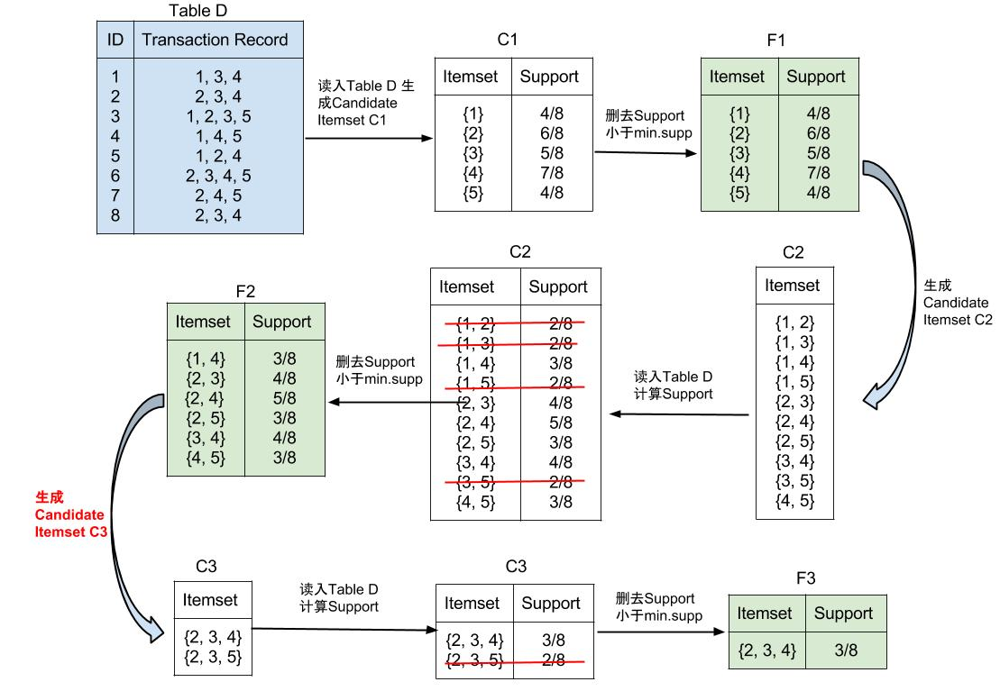

十大算法及其R实现 - Apriori算法
========================================================

Apriori算法作为数据挖掘中的经典算法，它是模型Association Rules(关联规则)的一种求解方法。因此，我们先来介绍模型：关联规则。

## 要解决的问题
> 关联规则解决的常见问题如：“如果一个消费者购买了产品A，那么他有多大机会购买产品B?”以及“如果他购买了产品C和D，那么他还将购买什么产品？”  
> 关联规则一个经典的实例是购物篮分析(Market Basket Analysis)。超市对顾客的购买记录数据库进行关联规则挖掘，可以发现顾客的购买习惯，例如，购买产品X的同时也购买产品Y，于是，超市就可以调整货架的布局，比如将X产品和Y产品放在一起，增进销量。 [（维基百科）](http://zh.wikipedia.org/wiki/%E5%85%B3%E8%81%94%E5%BC%8F%E8%A7%84%E5%88%99)

要讲关联规则，就不得不提到经典的例子“啤酒与尿布”。据说在美国沃尔玛超市中，管理分析人员发现：在某些情况下，啤酒和尿布会经常被一起购买。他们认为是由于年轻的父亲们在为婴儿购买尿布的同时，顺便为自己购买啤酒。因此管理人员把啤酒和尿布放在一起，提醒父亲们在买尿布的同时，“顺便”购买啤酒。不过这个案例的真实性一直受到人们的质疑。但是并不妨碍它常常出现在各大学校的数据挖掘课本中作为理解关联规则的一个有趣的例子。

所以，关联规则是用来在数据集中找到items(项)之间的关系。例如：“70%买了牛奶的顾客同时也买了面包”，但是只有 “20%买了牛奶的顾客会同时买袜子”。

## 关联规则模型
要研究关联规则首先要有一些items（如超市里面所有的商品）以及他们出现的记录basket of items（超市每一条交易记录）.  
挖掘items之间的关系就是找到经常一起在basket中出现的items。

#### 1. 什么叫“规则”？  
if-then 规则: “If {$I_1, I_2, ..., I_m$}, then $I_k$” 表示“在basket里已经包括了items{$I_1, I_2, ..., I_m$}，再加上$I_k$”，记做 {$I_1, I_2, ..., I_m$} --> $I_k$。其中 {$I_1, I_2, ..., I_m$}叫做规则的antecedent or left-hand-side(LHS), $I_k$ 叫做规则的consequent or right-hand-side(RHS)，而且$LHS \cap RHS = \emptyset$, 所以关联规则不能产生{A, B} --> {A, B, C}的规则。

#### 2. 如何度量“规则”是否足够好？  
1.Support(A):有多少条记录中包含了商品A     

e.g. Support({面包}) = 面包的购买次数 ； Support({面包，牛奶}) = 同时购买了面包和牛奶的交易次数  
当然，有时也把Support表示为分数，除以总购买记录数。可用概率表示为Support(A) = $P(A)$, 即购买商品A本身的概率。   
好的“规则”应该 **Common** : $Support(A) \ge min.supp$ ，min.supp为可设置的最小support阈值。      
  

2.Confidence(A --> B) : 这条规则的可信程度，即在购买了商品A的条件下还会购买商品B的条件概率。     

Confidence(A --> B) = $P(B|A)$ = $\frac{Support(A and B)}{Support(A)}$ = $\frac{同时购买了A商品和B商品的次数}{A的购买次数}$    
好的“规则”应该 **Right** : $Confidence(A --> B) \ge min.conf$ ，min.conf为可设置的最小confidence阈值。       

同时满足条件1和条件2的规则就可称为：**Strong Rules(强关联规则)**。

3.Lift(A --> B) : 相对于不使用规则，使用这个规则后的效果；即在购买了商品A的条件下还会购买商品B的条件概率与直接购买商品B的概率之比     
Lift(A --> B) = $\frac{P(B|A)}{P(B)}$ = $\frac{Confidence(A --> B)}{Support(B)}$  
好的“规则”应该 **Useful** : $Lift(A --> B) \ge 1$  
Re: Lift只是一种选择rules的条件，可以有其他的条件来代替。  
#### 3. 例子

Transaction_ID | Items  
-------------- | ---------------------
1              | 面包，可乐，牛奶
2              | 可乐，面包
3              | 啤酒，可乐，尿布
4              | 啤酒，面包，尿布，牛奶
5              | 可乐，啤酒，牛奶

假设min.supp = 30%, min.conf = 50%.  

5条记录中，{可乐，面包}同时出现在2条记录中，所以Support(可乐，面包) = $\frac{2}{5}$，可以解释为“顾客同时购买可乐和面包的概率是40%”。而单独购买面包的次数是三次,所以Support(面包) = $\frac{3}{5}$。  
则Confidence(面包 --> 可乐)=$\frac{Support(可乐，面包)}{Support(面包)}$= $\frac{2}{3}$, 表示在所有买过面包的用户中，有67%的人还买了可乐。这个规则同时满足min.supp 和min.conf，因此属于强关联规则。     
而单独购买可乐的次数是四次，所以Support(可乐) = $\frac{4}{5}$。Lift(面包 --> 可乐) = $\frac{Confidence(面包 --> 可乐)}{Support(可乐)}$ = $\frac{2/3}{4/5} = 0.83375$。    

而5条记录中{啤酒，尿布}同时出现在2条记录中，所以Support(啤酒，尿布) = $\frac{2}{5}$，可以解释为“顾客同时购买啤酒和尿布的概率是40%”。而单独购买尿布的次数是两次,所以Support(尿布) = $\frac{2}{5}$。  
则Confidence(尿布 --> 啤酒)=$\frac{Support(啤酒，尿布)}{Support(尿布)} = \frac{0.4}{0.4} = 1$, 表示在所有买过尿布的用户中，100%的人还买了啤酒。这个规则也属于强关联规则。   
而单独购买啤酒的次数是三次，所以Support(啤酒) = $\frac{3}{5}$。Lift(尿布 --> 啤酒) = $\frac{Confidence(尿布 --> 啤酒)}{Support(啤酒)}$ = $\frac{1}{3/5} = 1.6667$。  

因此，虽然面包与可乐是强关联规则，但是对买了面包的人推荐可乐是随机推荐可乐的0.83375倍， 说明使用了这条规则的推荐还不如随机推荐的效果好。而对买了尿布的人推荐啤酒是随机推荐啤酒的1.6667倍。所以第二条规则是更有用的。


## Apriori算法
我们使用Apriori算法来找到所有满足min.supp条件的frequent itemsets以及他们的support, 然后计算confidence并生成strong rules。  
定义k-itemset : {$I_1, I_2, ..., I_k$} 总共有k个元素, 如{面包}属于1-itemset, {面包，牛奶}属于2-itemset。   

#### Apriori生成Frequent Itemsets  
算法描述如下：  

- 扫描全部的single items in all baskets; 如果support大于设置的阈值min.supp，便可保留；否则删去
- 循环以下步骤，直到无法生成新的itemset：
  + 生成Candidate Itemsets $C_k$: 对于保留的(k-1)-itemsets其中的每一对，如果他们有(k-2)个相同的元素，就把这两个合并为同一个k-itemset
  + 生成Frequent Itemsets $F_k$ （ Prune ）: 对于$C_k$的每个k-itemset，如果其support大于阈值min.supp，便可保留；否则删去
  
Re(1): Frequent Itemsets的子集必须都是Frequent Itemset. 即如果{A,B,C}为$F_3$,必须保证{A},{B},{C}为$F_1$，而且{AB},{AC},{BC}为$F_2$。    
Re(2): Infrequent Itemsets的超集都是Infrequent Itemsets. 即如果{A, B}不属于$F_2$, 那么任意包含{A, B}的集合都不可能属于Frequent Itemset.


下面我们用一个例子演示一下Apriori算法生成Frequent Itemsets的过程。 
这里总共有8条交易记录，所以计算support时都要除以8. 设参数为min.supp = 3 / 8, min.conf = 0.75


在生成Candidate Itemset $C_3$时要特别注意。因为我们前面提到了Frequent Itemsets的子集必须都是Frequent Itemset，所以虽然{1,4}和{2,4}都属于$F_2$，但是由于{1, 2}不属于$F_2$，所以生成的$C_3$中并没有{1,2,4}这一项。      

#### 生成Rules
对每一个Frequent Itemset $Y \in F_k$, 都可以生成$2^k - 2$个规则。分解$Y$为两个非空的子集$X$和$Y - X$，生成规则{X --> Y-X}, 并计算其confidence，如果大于min.conf，就是一条强关联规则。  
如上例中, {2, 3, 4} $\in F_3$, 可以生成规则：
{2 --> {3, 4}}(conf = 0.5), {{3, 4} --> 2}(conf = 0.75), {3 --> {2, 4}}(conf = 0.6), {{2, 4} --> 3}(conf = 0.6), {4 --> {2, 3}}(conf = 0.428), {{2, 3} --> 4}(conf = 0.75)  
所以，其中只有{{3, 4} --> 2}(conf = 0.75) 和 {{2, 3} --> 4}(conf = 0.75) 属于强关联规则，可以最后被保留下来。  

## R实现
R中可用arules包来实现apriori算法，并且arulesViz包可以用来可视化生成的规则。我们用arules包中的dataset Groceries. 它包括9835条交易记录，共有169种items。用summary命令可以看到出现次数最多的items,分别是whole milk，other vegetables等。还可以看到交易记录的长度(每个篮子含有的item个数)分布，平均的交易记录长度是4.409，中位数是3。而且由于class的结果是“transaction”，所以只能用inspect来显示具体的交易记录。

```r
require(arules)
data("Groceries")
class(Groceries)
```

```
## [1] "transactions"
## attr(,"package")
## [1] "arules"
```

```r
summary(Groceries)
```

```
## transactions as itemMatrix in sparse format with
##  9835 rows (elements/itemsets/transactions) and
##  169 columns (items) and a density of 0.02609 
## 
## most frequent items:
##       whole milk other vegetables       rolls/buns             soda 
##             2513             1903             1809             1715 
##           yogurt          (Other) 
##             1372            34055 
## 
## element (itemset/transaction) length distribution:
## sizes
##    1    2    3    4    5    6    7    8    9   10   11   12   13   14   15 
## 2159 1643 1299 1005  855  645  545  438  350  246  182  117   78   77   55 
##   16   17   18   19   20   21   22   23   24   26   27   28   29   32 
##   46   29   14   14    9   11    4    6    1    1    1    1    3    1 
## 
##    Min. 1st Qu.  Median    Mean 3rd Qu.    Max. 
##    1.00    2.00    3.00    4.41    6.00   32.00 
## 
## includes extended item information - examples:
##        labels  level2           level1
## 1 frankfurter sausage meet and sausage
## 2     sausage sausage meet and sausage
## 3  liver loaf sausage meet and sausage
```

```r
inspect(head(Groceries, 3))
```

```
##   items                
## 1 {citrus fruit,       
##    semi-finished bread,
##    margarine,          
##    ready soups}        
## 2 {tropical fruit,     
##    yogurt,             
##    coffee}             
## 3 {whole milk}
```

```r
rules <- apriori(Groceries, parameter = list(support = 0.001, confidence = 0.5))
```

```
## 
## parameter specification:
##  confidence minval smax arem  aval originalSupport support minlen maxlen
##         0.5    0.1    1 none FALSE            TRUE   0.001      1     10
##  target   ext
##   rules FALSE
## 
## algorithmic control:
##  filter tree heap memopt load sort verbose
##     0.1 TRUE TRUE  FALSE TRUE    2    TRUE
## 
## apriori - find association rules with the apriori algorithm
## version 4.21 (2004.05.09)        (c) 1996-2004   Christian Borgelt
## set item appearances ...[0 item(s)] done [0.00s].
## set transactions ...[169 item(s), 9835 transaction(s)] done [0.00s].
## sorting and recoding items ... [157 item(s)] done [0.00s].
## creating transaction tree ... done [0.00s].
## checking subsets of size 1 2 3 4 5 6 done [0.01s].
## writing ... [5668 rule(s)] done [0.00s].
## creating S4 object  ... done [0.00s].
```

注意arules包中的apriori只能产生RHS（规则右端）只含有一个item的规则。  
- parameter必须是一个list，包括一些参数：
  + support表示你的最小阈值min.supp, confidence表示你的最小阈值min.conf。 
  + minlen 表示规则左右两端包含的最小item个数，如果minlen = 1(default),就会产生规则左端为空的结果，如 { } --> {啤酒}, 用来表示随机推荐的情况。如果想避免这种推荐，可以设置parameter = list(minlen = 2). 而maxlen就表示规则的最大item个数(default:10)。 
  + target表示想要的association rules模型的结果，我们使用的都是"rules"(default)，其他可以生成的结果有"frequent itemsets","maximally frequent itemsets","closed frequent itemsets". 
  + arem 可以设置其他的衡量rules是否足够好的标准，如"diff","info","chi2".       
- 除了parameter之外，还可以使用appearance = list()来控制rules的结果中希望有哪些item出现在左端/右端/两端。还可以使用control=list()来控制rules计算时的一些参数，如sort表示升序或降序排列，heap表示是否使用heap sort。    

生成rules之后可以按照某一标准来排序，可以用summary(rules)来看一下汇总信息，也可以用subset()来显示含有某些item的子集，或者用inspect()查看rules。

```r
# summary(rules)
rules.sorted <- sort(rules, by = "lift")
rulesRollsBuns <- subset(rules, subset = rhs %in% "rolls/buns" & lift > 1.2)
inspect(head(sort(rulesRollsBuns, by = "confidence"), n = 3))
```

```
##   lhs                     rhs           support confidence  lift
## 1 {spread cheese,                                               
##    newspapers}         => {rolls/buns} 0.001220     0.7500 4.078
## 2 {beef,                                                        
##    tropical fruit,                                              
##    whole milk,                                                  
##    yogurt}             => {rolls/buns} 0.001322     0.6842 3.720
## 3 {citrus fruit,                                                
##    whole milk,                                                  
##    whipped/sour cream,                                          
##    pastry}             => {rolls/buns} 0.001017     0.6667 3.624
```


可以删去其中redundant的规则。

```r
subset.matrix <- is.subset(rules.sorted, rules.sorted)
subset.matrix[lower.tri(subset.matrix, diag = T)] <- NA
redundant <- colSums(subset.matrix, na.rm = T) >= 1
length(which(redundant))
```

```
## [1] 1710
```

```r
rules.pruned <- rules.sorted[!redundant]
```


要是自己的数据写成binary matrix的形式可以用下面的命令生成transaction类.

```r
a_matrix <- matrix(c(1, 1, 1, 0, 0, 1, 1, 0, 0, 0, 1, 1, 0, 1, 0, 0, 0, 1, 0, 
    1, 1, 1, 0, 1, 1), ncol = 5, dimnames = list(c("id1", "id2", "id3", "id4", 
    "id5"), c("bread", "coke", "milk", "beer", "butter")))
a_matrix
```

```
##     bread coke milk beer butter
## id1     1    1    1    0      1
## id2     1    1    1    0      1
## id3     1    0    0    1      0
## id4     0    0    1    0      1
## id5     0    0    0    1      1
```

```r
transaction.of.a_matrix <- as(a_matrix, "transactions")
class(transaction.of.a_matrix)
```

```
## [1] "transactions"
## attr(,"package")
## [1] "arules"
```


下面我们来看一些arulesViz中提供的可视化方法。基本的函数是：  

```r
plot(x, method = NULL, measure = "support", shading = "lift", interactive = FALSE, 
    data = NULL, control = NULL, ...)
```

plot(rules)会生成最简单的散点图，support和confidence分别是坐标轴，lift是color. 可以看出lift比较高的rules，support都比较小.当然也可以改变他们的顺序，如下面右边的图。

```r
require(arulesViz)
```

```
## Loading required package: arulesViz
## Loading required package: grid
## 
## Attaching package: 'arulesViz'
## 
## The following object is masked from 'package:base':
## 
##     abbreviate
```

```r
plot(rules.pruned)
```

 

```r
plot(rules.pruned, measure = c("support", "lift"), shading = "confidence")
```

 


```r
graphrules <- head(sort(rules.pruned, by = "lift"), 10)
plot(graphrules, method = "graph")
```

 


arulesViz还提供一个函数，可以把rules保存成"graphml"的格式，然后就可以丢进Gephi或者igraph里面了。

```r
saveAsGraph(head(sort(rules, by = "lift"), 1000), file = "rules.graphml")
```


## 一些注意的地方      
- Apriori只是其中一种实现关联规则生成Frequent Itemsets的算法，针对这个算法本身有一些改进。 此外还有其他的算法来实现关联规则，如FP-growth算法, Eclat算法等，arules包中也提供Eclat算法的实现。
- 而Association Rules本身也有一些相关的模型。我们这里介绍的主要是只考虑关联规则中的数据项是否出现而且不涉及不同层次的数据项的single-stage and Boolean association rules. 还可以建立Multilevel Association Rules考虑items之间的层属关系。或者考虑年龄等数量型变量的quantitative association rules.
