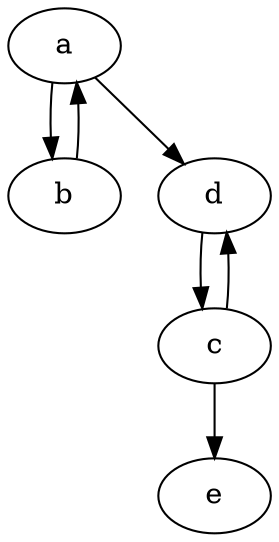

PageRank 是 Google 的评价网页重要性的算法之一。它由 Google 的创始人 Larry Page 与 Sergey Brin 于 1998 年发表[1]。现在 PageRank 已经不是 Google 搜索技术的主要支撑，但是这个算法依然具有启发性和实用性。

本文的内容主要参照 Wikipedia 的 PageRank 词条[2]，代码根据算法定义写出来。

本文文本根据 [CC BY-SA](http://creativecommons.org/licenses/by-sa/3.0/) 协议发布，代码片段根据 [GPLv2](http://www.gnu.org/licenses/gpl-2.0.html) 协议或其后的版本发布。

直观理解：

PageRank 通过网页的链接进入的数目来确定网站的重要性。比如，很多网站的都有对 example.com 的链接，但是没有任何网站提供对 example.org 的链接，那么 example.com 的 PageRank 值比较高，表示它比较重要；example.org 的 PageRank 值接近 0，重要性很低。

Google 通过名称为 GoogleBot 的网页爬虫程序抓取并且分析网页，接着提取出链接信息，最后计算出每一个网站的 PageRank 值（Google 提供给公众的版本是 0 到 10 的一个数，10 表示权重最高，0表示权重最低）。


算法：

现在认可度比较高的公开的 PageRank 算法版本是这样的：

对于特定的页面集合，$p_i$ 是被研究的页面，$N$ 是被研究页面的总数量，$M(p_i)$ 是链接向 $p_i$ 页面的集合，$L(p_j)$ 是页面 $p_j$ 的外链的数量，$d$ 被称为阻尼系数（damping factor），通常取值 0.85。

$$PR(p_i) = \frac{1-d}{N} + d \sum_{ p_j \in M(p_i)} \frac{PR (p_j) }{ L(p_j) }$$

这算法中页面 PageRank 范围在 0 到 1 之间。

令
$$ \mathbf{P} =
\begin{bmatrix}
PR(p_1) \\
PR(p_2) \\
\vdots \\
PR(p_N)
\end{bmatrix}$$

$$\mathcal{M_{ij}} = \begin{cases} 1 /L(p_j) , & \mbox{if }j\mbox{ links to }i\ \\ 0, & \mbox{otherwise} \end{cases}$$

则对这些页面集合，可以用这个矩阵等式表示各个页面的 PageRank：

$$ \mathbf{P} = d  \mathcal{M}  \mathbf{P} + \frac{1-d}{N} \mathbf{1} $$

此外，一个有用的结论是，令 $K$ 为对角矩阵，对角线为每一个页面的外链数量，并且令 $A$ 为邻接矩阵，即如果第 i 个页面有向第 j 个页面的链接的话则 $A_{ij}=1$，则有以下等式成立：

$$\mathcal{M_{ij}} = (K^{-1} A)^T $$

举个例子，以下图作为例子：有这么五个页面 a 到 e，它们之间有一些页面存在着指向向另外一些页面的链接，比如说页面 a 有两个链接，分别指向页面 b 和 d。页面 d 有 页面 a 和 c 的链接指向它。



根据上图，我们可以列出以下五个方程，N=5，d=0.85：
$$PR(p_a) = \frac{1-d}{N} + d \frac{PR(p_b) }{ 1 }$$
$$PR(p_b) = \frac{1-d}{N} + d \frac{PR(p_a) }{ 2 }$$
$$PR(p_c) = \frac{1-d}{N} + d \frac{PR(p_d) }{ 1 }$$
$$PR(p_d) = \frac{1-d}{N} + d (\frac{PR(p_a) }{ 2 } + \frac{PR(p_c) }{ 2 })$$
$$PR(p_e) = \frac{1-d}{N} + d \frac{PR(p_c) }{ 2 }$$

解以上的方程组涉及到随机过程和矩阵的相关知识。

（前方高能！）具体来说，有两种方式。

第一种方式，是建立一个被称为随机游走的随机过程模型。

这种模型可以通过模拟人类浏览网页的行为来方便理解。比如说，人类在 $t=i$ 时刻浏览页面 a，因为 a 页面有指向 b 的链接，人类有一定的概率在时刻 $t=i+1$ 顺着链接浏览到网页 b。把这种浏览行为根据数学方式刻画出来，就可以得知人类对访问某一网页的倾向，而这种倾向是和网页链接信息相关的。

具体上说，视 PageRank 矩阵 $P$ 为关于时间 $t$ 的时间序列，当时间 $t=0$ 的时候，初始化 PageRank 矩阵为

$$ \mathbf{P(t=0)} =
\begin{bmatrix}
1/N \\
1/N \\
\vdots \\
1/N
\end{bmatrix}$$

然后用迭代方式，

$$ \mathbf{P(t=i+1)} = d  \mathcal{M}  \mathbf{P(t=i)} + \frac{1-d}{N} \mathbf{1} $$

可以证明，在某些约束条件下，$t \to \infty$ 时间序列是平稳收敛的，进而，在工程学上，可以通过迭代若干次数来的到比较准确的 $$\mathbf{P(t=i+1)}$$ 值。比如说，迭代 100 次。

第二种方式，是纯数学上的，直接运用矩阵知识解那个 $P$ 满足的方程：

$$\mathbf{P} =  (\mathbf{I}-d \mathcal{M})^{-1} \frac{1-d}{N}\mathbf{1}$$

这种方式理论上能得到精确的解。但是实践上可能会有计算量带来的问题。


R 语言编程版本：

Talk is cheap, show me the code.

以下是根据以上算法给出的 PageRank 求解的 R 语言程序。`get_pagerank()` 是求 PageRank 的函数，`get_info()` 是一个可能有用的辅助函数。这个程序是完整的，但是由于没有经过优化，很可能在比较多数据的情况下造成效率上的问题。

```r
#' @param info the data frame oject of the graph, in which headers from and to are REQUIRED
#' @param use_iter whether using iterating method or not, defaultly TRUE 
#' @param iterate_times if using iterating method, this indicates the times, defaultly 100
#' @param d the damping factor, defaultly 0.85
#' @return pr the n*1 matrix of the pageranks of each node
get_pagerank <- function(info, use_iter=TRUE, iterate_times=100, d=0.85){
    # grab all the nodes, i.e. factor levels into one vector
    nodes = levels(unlist(list(info$from, info$to)))
    info$from = factor(info$from, levels=nodes)
    info$to = factor(info$to, levels=nodes)

    # how many nodes?
    nodes_count = length(nodes)

    # get a n*n diagonal matrices describing the count of outbound links for each node
    # outdegree_matrix = diag(as.integer(summary(info$from)))
    inverse_outdegree_matrix = diag(1/as.integer(summary(info$from))) # well, some Inf occur...
    inverse_outdegree_matrix = replace(inverse_outdegree_matrix, is.infinite(inverse_outdegree_matrix), 0) # tricky

    # get the adjacency matrix
    # by scanning the graph of info
    adj_matrix = matrix(0, nodes_count, nodes_count)
    for (i in seq(1, nrow(info))) {
        one_edge = info[i,]
        index_node_from = match(one_edge$from, nodes)
        index_node_to = match(one_edge$to, nodes)
        adj_matrix[index_node_from, index_node_to] = 1
    }

    # get the normalized adjacency matrix
    norm_adj_matrix = t(inverse_outdegree_matrix %*% adj_matrix)

    if(use_iter){
        # if using iterating method

        # first step, initial the pagerank as n*1 matrix
        # t = 0
        pr = as.matrix(rep(1/nodes_count, nodes_count))

        # secondly, iterate!
        # t = i
        for (i in seq(1, iterate_times)) {
            pr = matrix((1-d)/nodes_count, nodes_count, 1) + d * norm_adj_matrix %*% pr

        }
    }
    else{
        # or, another way
        # directly solve it!
        pr = solve(diag(nodes_count) - d * norm_adj_matrix) %*% matrix((1-d)/nodes_count, nodes_count, 1)
    }

    return(pr)
}

#' @param csv_file the path of the csv file of the graph
#' @return info the data frame oject of the graph
get_info <- function(csv_file){
    info <- read.csv(csv_file, header=T, colClasses='factor')
    return(info)
}
```

怎样使用以上代码呢？其实注释已经比较明确了。这里用前文所使用的例子说明一下。

有这么一个链接的关系（前文例子）：


可以用这么一个 data.frame / csv 文件表示：

```csv
from,to
a,b
a,d
b,a
c,d
c,e
d,c
```

现在想用迭代方式求解 a 到 d 页面的 PageRank，迭代 90 次，记为 `pr1`；或者用矩阵知识直接求解，记为 `pr2`。代码如下：

```r
# generate a data frame called 'info'
# 'info' MUST have headers 'from' and 'to'
info = data.frame(from=c('a','a','b','c','c','d'), to=c('b','d','a','d','e','c'))

pr1 = get_pagerank(info, use_iter = T, iterate_times = 90)
pr1
##            [,1]
## [1,] 0.08688845
## [2,] 0.06692759
## [3,] 0.13602889
## [4,] 0.12473987
## [5,] 0.08781228

pr2 = get_pagerank(info, use_iter = F)
pr2
##            [,1]
## [1,] 0.08688845
## [2,] 0.06692759
## [3,] 0.13602889
## [4,] 0.12473987
## [5,] 0.08781228
```

可以知道，迭代 90 次之后，结果和直接求解释解的结果相差无几，至少达到了小数点后 8 位的精度了。可以得知页面 a 的 PageRank 约 0.09，页面 b 的 PageRank 约 0.07，页面 c 约 0.14，页面 d 约 0.12，页面 e 的 PageRank 约 0.08。


总结：

本文介绍了 Google 使用的 PageRank 技术，数学表达式，简单说明了求数值解和解释解的方法，最后给出了完整（但是没有经过优化）的 R 语言程序和使用方式。

有志之士可以证明一下 $\mathbf{P}$ 时间序列的收敛性，也可以用 `Matrix` 包或者其余技术探索更加高效率的 PageRank 算法。


延伸阅读：

程序员张丹(Conan) 在他的博客上用同样的思路介绍了 PageRank 的 R 语言实现[3]，和本文的实现很类似，本质上是一样的。并且，他的博客有用 MapReduce 方式实现 PageRank 的进阶文章[4]，推荐阅读。

Feature Column 网站上有一篇深入浅出介绍 PageRank 的文章[5]，也推荐阅读。


参考：

[1] Brin, S.; Page, L. (1998). "The anatomy of a large-scale hypertextual Web search engine". Computer Networks and ISDN Systems 30: 107–117. doi:10.1016/S0169-7552(98)00110-X. ISSN 0169-7552.

[2] http://en.wikipedia.org/wiki/PageRank

[3] http://blog.fens.me/algorithm-pagerank-r/

[4] http://blog.fens.me/algorithm-pagerank-mapreduce/

[5] http://www.ams.org/samplings/feature-column/fcarc-pagerank
